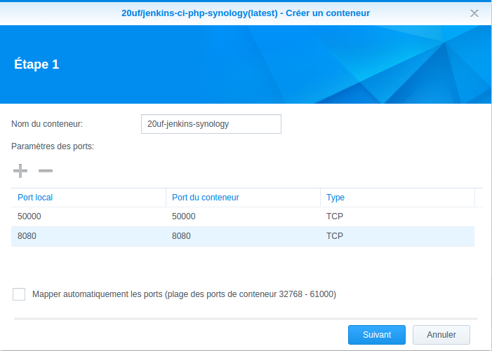
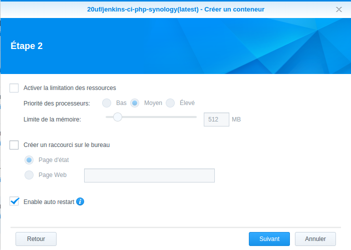
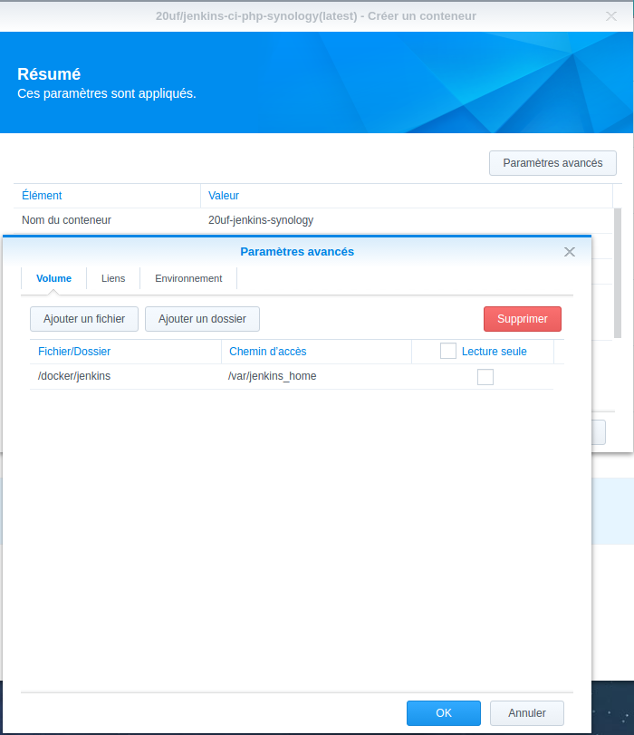
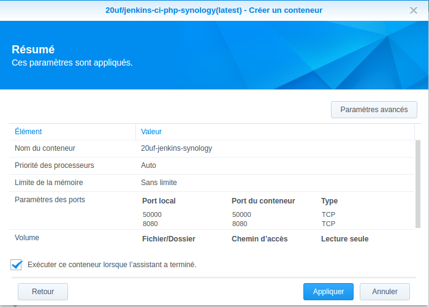
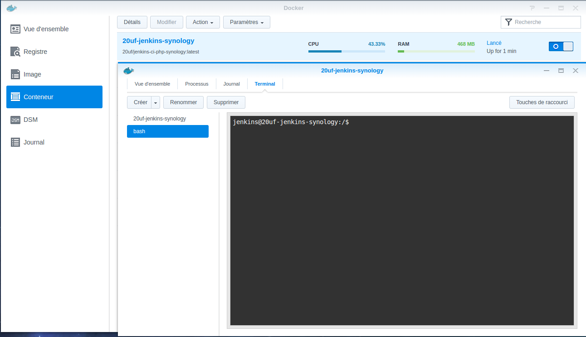

# jenkins-ci-php-synology

> Dockerized Jenkins CI with PHP for Synology docker

The Synology Dockerized Jenkins PHP gives you everything you need to use Jenkins on Synology DSM to automate your deployements and continuous integration.

## Requirements

* [DiskStation Manager 6.0](https://www.synology.com/fr-fr/dsm/6.0)
* [DSM package Docker](https://www.synology.com/en-us/dsm/app_packages/Docker)

## Running

Create a container and configure ports

Enable auto restart

Create a folder on your Synology docker and assigned the rights neccessaires, then mount /var/jenkins_homes

Validate and jenkins is avaliable on http://your-host:8080

## License

Copyright &copy; 2016 [20uf](http://github.com/20uf). Licensed under the terms of the [MIT license](LICENSE.md).
